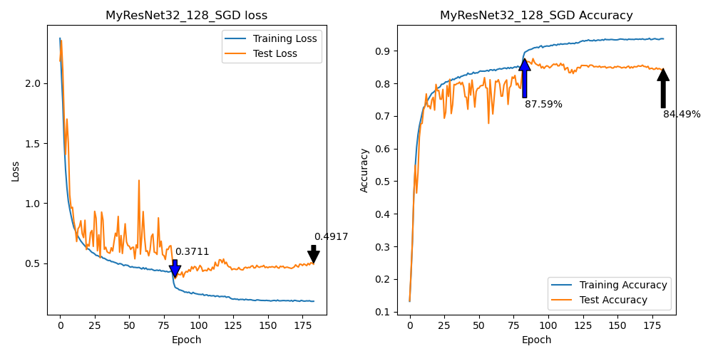
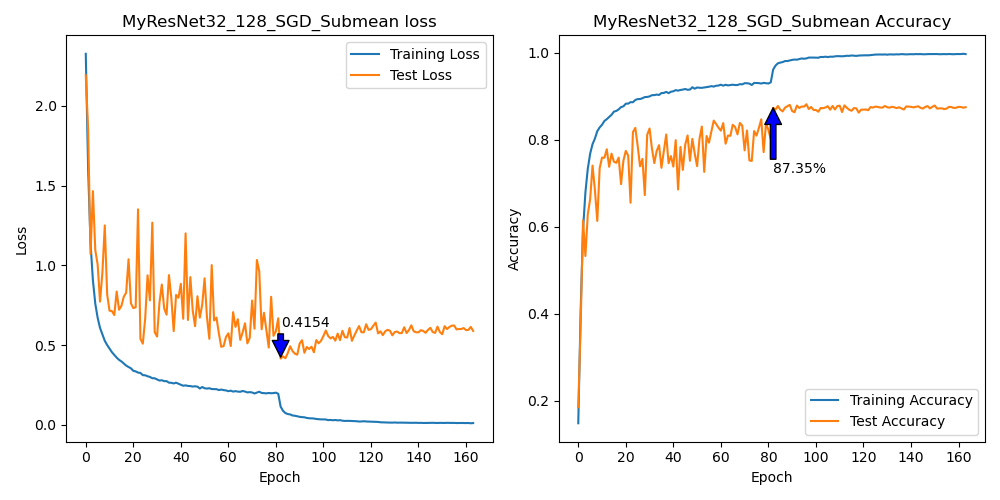
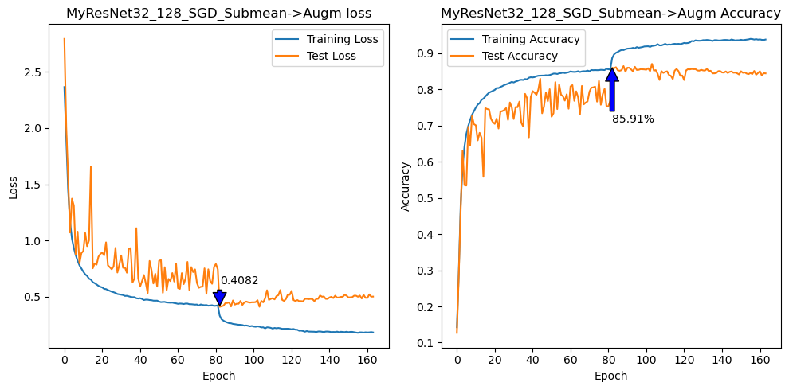
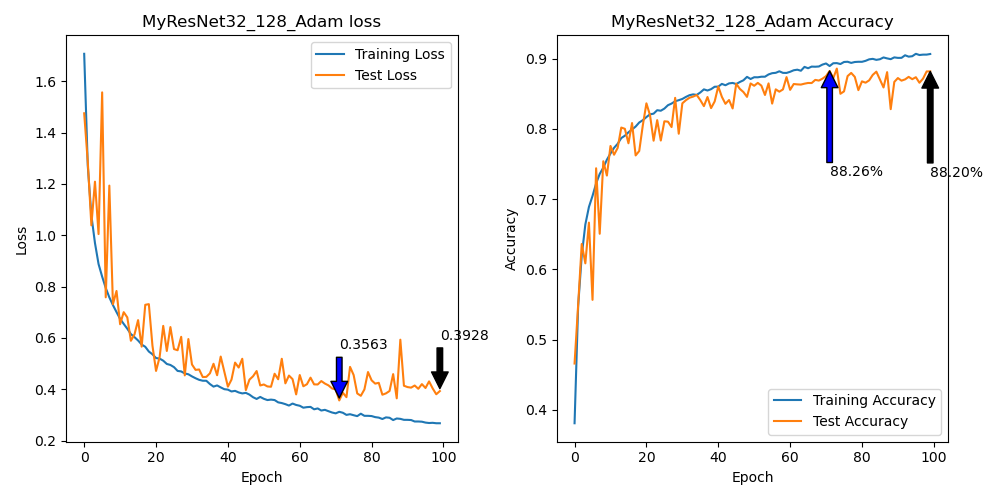
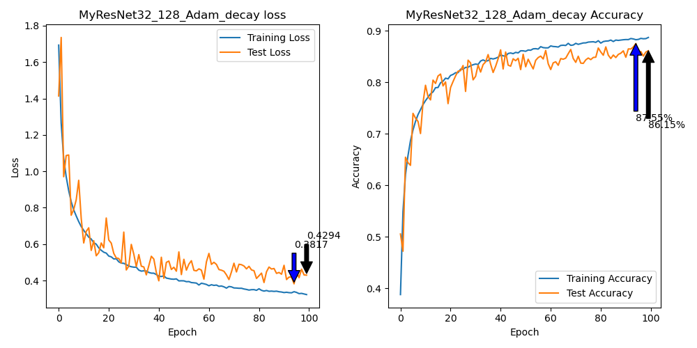
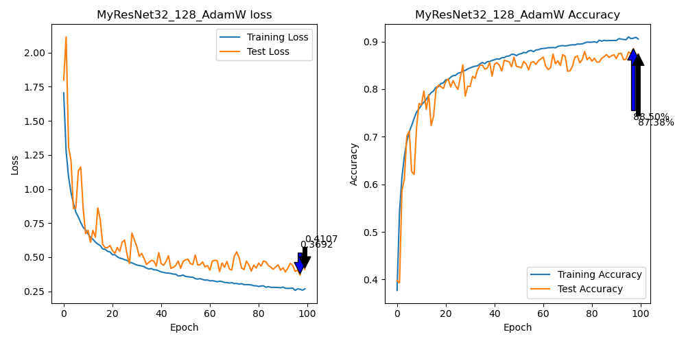
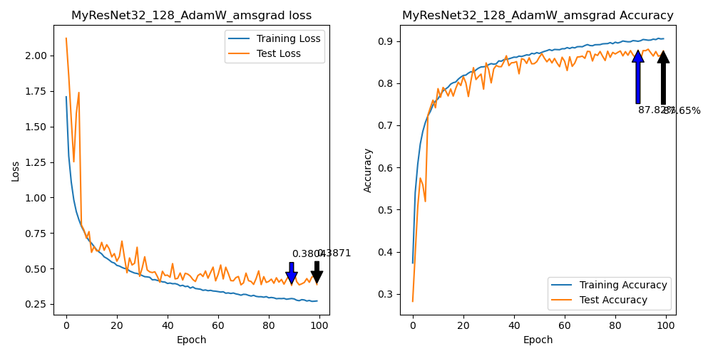
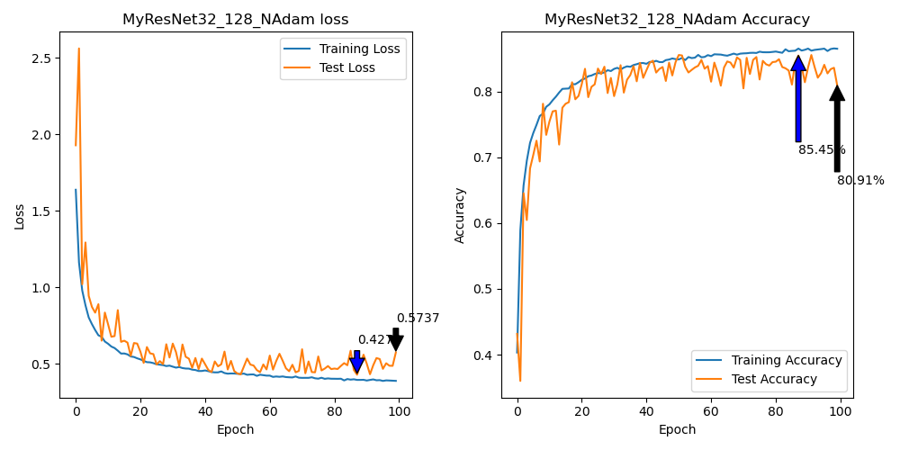
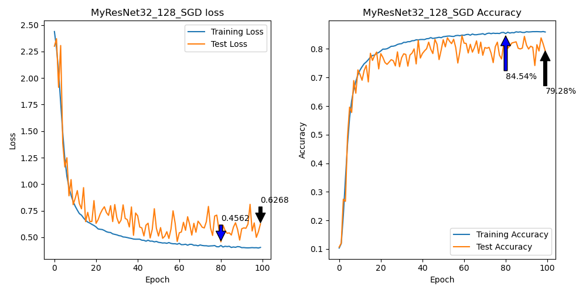
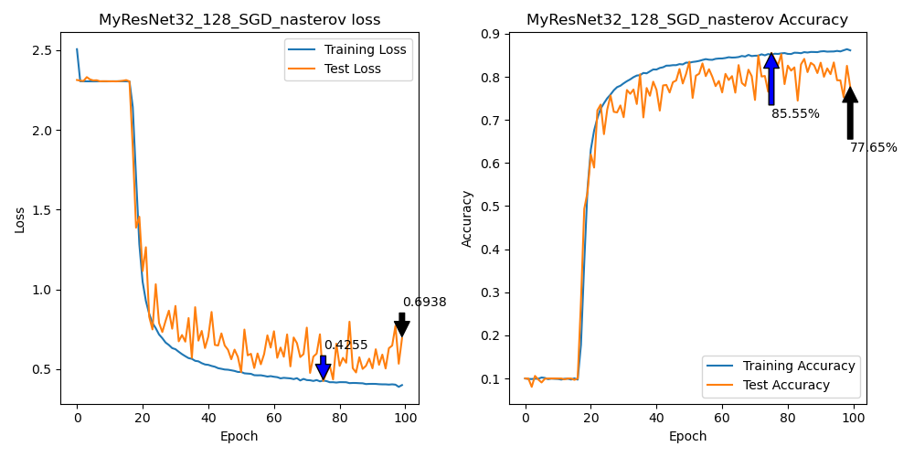

# MyResNet
##### LEE, JIHO
> Dept. of Embedded Systems Engineering, Incheon National University

> jiho264@inu.ac.kr /  jiho264@naver.com
 
- The purpose of this project is that to create a ResNet using Pytorch and to get the accuracy of near original paper's one!
- [x] The Origin ResNet32 have 7.51% top-1 error rate in CIFAR-10 dataset.
- [ ] The Origin ResNet34 have 21.53% top-1 error rate in ImageNet2012 dataset.
  >Haven't achieved that yet. 
---
# 1. Usage
## 1.1. Requierments
  - ```Ubuntu 20.04 LTS```
  - ```Python 3.11.5```
  - ```Pytorch 2.1.1```
  - ```CUDA 11.8```
  - ```pip [copy, time, tqdm, matplotlib, etc..]```
  - I used ```i7-9700k, DDR4 64GB, GTX3090```
## 1.2. How to compose this repo?
```bash
├── data "The root dir of torch.utils.data.Dataloader"
│   ├── etc..
│   └── ImageNet2012 "Need to download"
│       ├── train
│       └── val
├── models
│   ├── MyResNet32_CIFAR10_128_SGD
│   │   └── etc..
│   ├── MyResNet32_CIFAR10_128_SGD_90
│   │   └── etc..
│   ├── MyResNet32_CIFAR10_128_SGD_95
│   │   └── etc..
│   └── MyResNet34_ImageNet2012_256_SGD
│       ├── MyResNet34_256_SGD.ipynb "Training Code"
│       ├── MyResNet34_256_SGD.pth.tar "Check Point"
│       └── MyResNet34_256_SGD.pth "Only parameters of model"
└── src
     └── "Source Codes"
``` 
## 1.3. How to run 
  - Run ```models/{dir}/{model_name}_{dataset}_{batch}_{optimizer}.ipynb```
  - Options
    - ```BATCH = 256```
    - ```DATASET = {"CIFAR10", "CIFAR100", "ImageNet2012"}```
    - ```optimizer = {"Adam", "AdamDecay", "SGD"}```
  - The trained model is ```{model_name}_{dataset}_{batch}_{optimizer}.pth```
## 1.4. The Manual from Original Paper
### 1.4.1. Implementation about training process :
  - [x] We initialize the weights as on **He initialization**
  - [x] We adopt **batch normalization** after each convolutional and before activation
  - [x] We use **SGD** with a **mini-batch size of 256**
  - [x] The learning rate starts from **0.1** and is **divided by 10** when the error plateaus
  - [x] We use a **weight decay of 0.0001** and a **momentum of 0.9**
  - [x] We **do not use** dropout
  
### 1.4.2. ```MyResNet34``` preprocessing for ImageNet2012 :
  - [x] The image is resized with its shorter side randomly sampled in [256, 480] for scale augmentation [41]. 
  - [x] A 224×224 crop is randomly sampled from an image or its horizontal flip, with the per-pixel mean subtracted [21]. 
  - [x] The standard color augmentation in [21] is used.
    > So, Apply ```torchvision.transform.AutoAugment()```
  - [x] In testing, for comparison studies we adopt the standard 10-crop testing [21]. For best results, we adopt the fully- convolutional form as in [41, 13], and average the scores at multiple scales (images are resized such that the shorter side is in {224, 256, 384, 480, 640}).
    > Implemented on ```src/Prediction_for_MultiScaleTest.ipynb```

### 1.4.3. ```MyResNet_CIFAR``` preprocessing for CIFAR10 :
  - [x] 45k/5k train/valid split from origin train set(50k)
  - [x] 4 pixels are padded on each side, and a 32 x 32 crop is randomly sampled from the padded image or its horizontal flip.
  - [x] For testing, use original images
---

# 2. Experiments
## 2.1. AutoAugment is good?
- 동일한 세팅에서, 164 epochs (64k iterations) 학습 후, Test loss 및 Test acc를 비교함.
- 파란 화살표는 Test loss가 최소인 Best model의 성능임.
### 2.1.1. Case 1 : Submean -> AutoAugment


### 2.1.2. Case 2 : Submean


### 2.1.3. Case 3 : AutoAugment -> Submean


### 2.1.4. Conclusion
1. (1)과 (2)의 비교를 통해, AutoAugment을 적용하는 것이 더 좋은 결과를 보임.
2. (1)과 (3)의 비교를 통해, Submean 이후에 AutoAugment를 적용하는 것이 더 좋은 결과를 보임. 
   - 최소 Test loss 지점의 모델이 가지는 loss 및 acc모두 (1)이 높고, 학습 시에 loss의 진동도 적음.
3. 결론적으로, (1)의 방법이 가장 좋다고 볼 수 있음.
4. 추가적으로, (1)에서만 Test 시에 Test acc가 train acc보다 높은 것을 볼 수 있음. AutoAugment가 워낙 변칙적이라, 학습은 잘 되면서 Training은 더 어렵게 잘 Augmentation하는 것으로 보임.
    
    ---
## 2.2. ResNet32 Model on CIFAR10 
```py 
train.transforms = Compose(
    Compose([ToImage(), ToDtype(scale=True)])
    Normalize(mean=[0.49139968, 0.48215827, 0.44653124], std=[1, 1, 1], inplace=True)
    AutoAugment(interpolation=InterpolationMode.NEAREST, policy=AutoAugmentPolicy.CIFAR10)
    RandomCrop(size=(32, 32), padding=[4, 4, 4, 4], pad_if_needed=False, fill=0, padding_mode=constant)
    RandomHorizontalFlip(p=0.5)
) 
test.transforms = ToTensor() 
```

### 2.2.1. [BEST] MyResNet32_CIFAR_128_SGD 
- ```164 epochs``` (=64k iterations)
- ```batch = 128```
- ```split_ratio = 0```
- ```optimizer = torch.optim.SGD(model.parameters(), lr=0.1, momentum=0.9, weight_decay=0.0001)```
- ```scheduler = MultiStepLR(optimizer, milestones=[82, 123], gamma=0.1)```


- ```test_loss: 0.2384```
- ```test_acc: 92.37%```
- ```test_error: 7.63%```


### 2.2.2. MyResNet32_CIFAR_128_SGD_90 
- ```batch = 128```
- ```split_ratio = 0.9```
- ```optimizer = torch.optim.SGD(model.parameters(), lr=0.1, momentum=0.9, weight_decay=0.0001)```
- ```scheduler = ReduceLROnPlateau(patiance=10, factor=0.1, cooldown=40)```
- ```EarlyStopCounter = 50```


### 2.2.3. MyResNet32_CIFAR_128_SGD_95 
- ```batch = 128```
- ```split_ratio = 0.95```
- ```optimizer = torch.optim.SGD(model.parameters(), lr=0.1, momentum=0.9, weight_decay=0.0001)```
- ```scheduler = ReduceLROnPlateau(patiance=10, factor=0.1, cooldown=40)```
- ```EarlyStopCounter = 50```


### 2.2.5. Conclusion
- MultiStepLR로 논문의 학습 방법과 동일하게, 명시적인 Learning rate들을 적용함. 
  - 명시적인 lr 감소는 경험에 기반한 것인데, 이를 알아내기 위해선 시행착오가 필요할 것으로 보임. 시행착오가 없다면, 이런 명시적이며 효과적인 LR Scheduling Method를 찾을 수 없기 때문임.
- split한 것과의 비교
  - 간단한 Dataset이라, Validation Set으로 Learning Rate Scheduling이 기대만큼 효과적이지 않았음.
  - 오히려, Validation Set마저 학습했을 때에 가장 모델의 정확도가 높았음. 
    
    ---
## 2.3. Best ResNet34 model on ImageNet2012
```py
# Training set
train = Compose(
    RandomShortestSize(min_size=range(256, 480), antialias=True),
    RandomCrop(size=224),
    AutoAugment(policy=AutoAugmentPolicy.IMAGENET),
    RandomHorizontalFlip(self.Randp),
    ToTensor(),
    Normalize(mean=[0.485, 0.456, 0.406], std=[1, 1, 1], inplace=True),
)
# center croped valid set
valid = Compose(
    RandomShortestSize(min_size=range(256, 480), antialias=True),
    CenterCrop(size=368),
    ToTensor(),
    Normalize(mean=[0.485, 0.456, 0.406], std=[1, 1, 1], inplace=True),
)
# 10-croped valid set
scales = [224, 256, 384, 480, 640]
valid  = Compose(
    RandomShortestSize(min_size=scale[i]+1, antialias=True)
    TenCrop(size=scale[i])
    ToTensor()
    Normalize(mean=[0.485, 0.456, 0.406], std=[1, 1, 1], inplace=True)
)
```
### 2.3.1. MyResNet34_ImageNet_256_SGD_case1 
> 재실험 필요함.
- ```batch = 256```
- ```optimizer = torch.optim.SGD(model.parameters(), lr=0.1, momentum=0.9, weight_decay=0.0001)```
- ```scheduler = ReduceLROnPlateau(patiance=5, factor=0.1, cooldown=5)```
- ```EarlyStopCounter = 25```


- ```[Last] 68 epoch: train_loss=0.0003, train_acc=0.6224, valid_loss=1.2975, valid_acc=0.7239, lr=0.0010```
- ```Avg Loss: 26.3212, Avg Top-1 Acc: 0.4793, Avg Top-5 Acc: 0.7118```
  - ```TenCrop [224] on valid set : Loss: 25.1631, Top-1 Acc: 0.4722, Top-5 Acc: 0.7023```
  - ```TenCrop [256] on valid set : Loss: 23.1898, Top-1 Acc: 0.5017, Top-5 Acc: 0.7307```
  - ```TenCrop [384] on valid set : Loss: 23.3688, Top-1 Acc: 0.5272, Top-5 Acc: 0.7570```
  - ```TenCrop [480] on valid set : Loss: 26.6102, Top-1 Acc: 0.4966, Top-5 Acc: 0.7312```
  - ```TenCrop [640] on valid set : Loss: 33.2743, Top-1 Acc: 0.3986, Top-5 Acc: 0.6378```
  - Train set에서 acc가 낮은 현상 때문에, Test(10-crop)에서도 47%의 Top-1 Acc나옴. 
  - 논문에선 120 epochs까지 학습시켰는데, 68 epochs에서 Early Stop이 나오게 학습을 설정한 바람에 일찍 종료됨. 

### 2.3.2. MyResNet34_ImageNet_256_SGD_case2 
- ```batch = 256```
- ```optimizer = torch.optim.SGD(model.parameters(), lr=0.1, momentum=0.9, weight_decay=0.0001)```
- ```scheduler = ReduceLROnPlateau(patiance=10, factor=0.1, cooldown=25)```
- ```EarlyStopCounter = 40 (Ends with lr decreasing to 1e-5 at 133 epochs.)```


- ```[Last] 133 epoch: train_loss=1.2615, train_acc=0.6986, valid_loss=1.2469, valid_acc=0.7456, lr=0.0001```
- ```Avg Loss: 23.3628, Avg Top-1 Acc: 0.5403, Avg Top-5 Acc: 0.7688```
  - ```TenCrop(224) on valid set : Loss: 21.9221, Top-1 Acc: 0.5243, Top-5 Acc: 0.7521```
  - ```TenCrop(256) on valid set : Loss: 19.9588, Top-1 Acc: 0.5554, Top-5 Acc: 0.7796```
  - ```TenCrop(384) on valid set : Loss: 20.6820, Top-1 Acc: 0.5834, Top-5 Acc: 0.8047```
  - ```TenCrop(480) on valid set : Loss: 23.9707, Top-1 Acc: 0.5601, Top-5 Acc: 0.7878```
  - ```TenCrop(640) on valid set : Loss: 30.2803, Top-1 Acc: 0.4782, Top-5 Acc: 0.7199```
  - case1보다 더 오랜 시간에 걸쳐 학습한 덕에 training acc도 많이 올라옴.
  - 하지만 TenCrop Test 결과, 논문의 결과만큼 잘 나오지 아니함. test method에 문제가 있는가 살펴봐야 할 것 같음.
  - 학습 방법은 dataset transforms가 잘못되지 않았다는 가정 하에 논문과 상이한 부분 없는 것으로 보임.

## 2.4. What is the best optimizer?
> 하위 항목 전부 다시 테스트중
### 2.4.1. Comparing on CIFAR10
- ```Use MyResNet32```
- ```All batch = 128```
- ```All scheduler = ExponentialLR(optimizer, gamma=0.95)```

- | Optimizer | Test Loss | Test Acc |
  |:---------:|:---------:|:--------:|
  | Adam      | 0.3563    | **88.26%** |
  | Adam_decay| 0.3817    | 87.55%   |
  | AdamW     | 0.3692    | **88.50%**   |
  | AdamW_amsgrad| 0.3804 | 87.82%   |
  | NAdam     | 0.4274    | 85.45%   |
  | SGD       | 0.4562    | 84.54%   |
  | SGD_nasterov| 0.4255  | 85.55%   |
  > **AdamW**- **Adam** - Adam_amsgrad - Adam_decay - SGD_nasterov - NAdam - SGD
- Blue marker : [Available Training Result] Best min test loss epoch
1. Adam
   - 
   - ```optimizer = torch.optim.Adam(model.parameters())```
2. Adam with decay
   - 
   - ```optimizer = torch.optim.Adam(model.parameters(), weight_decay=1e-4)```
3. AdamW
   - 
   - ```optimizer = torch.optim.AdamW(model.parameters(), weight_decay=1e-4)```
4. AdamW with amsgrad
   - 
   - ```optimizer = torch.optim.AdamW(model.parameters(), weight_decay=1e-4, amsgrad=True)```
5. NAdam
   - 
   - ```optimizer = torch.optim.NAdam(model.parameters(), weight_decay=1e-4)```
6. SGD
   - 
   - ```optimizer = torch.optim.SGD(model.parameters(), lr=0.1, momentum=0.9, weight_decay=1e-4)```
7. SGD with nasterov
   - 
   - ```optimizer = torch.optim.SGD(model.parameters(), lr=0.1, momentum=0.9, weight_decay=1e-4, nesterov=True)```

---
# 3. Todo
1. ```TenCrop 잘못했나 찾아보기. ResNet34의 test acc가 너무 낮게 나왔음.```
   1. 논문의 training 할 때의 center crop으로 valid acc그린 plot있는데, lr=0.001인 부분에서 training acc가 해당 그래프 만큼 나오지 않음.
2. ```SGD말고 다른 Optimizer 적용해볼 수 있는지 알아보기.```
   1. MyResNet34_ImageNet2012_256_Multi에서 Datalodaer 1번에 두 가지 모델 병렬학습 구현 [Jan 26]. 및 AdamW, Adam with decay 학습 중.
   2. Adam에 weight decay 적용한게 AdamW임. Adam에 decay=1e-4주는거랑 똑같지만, option으로 amsgrad=True만 다름.