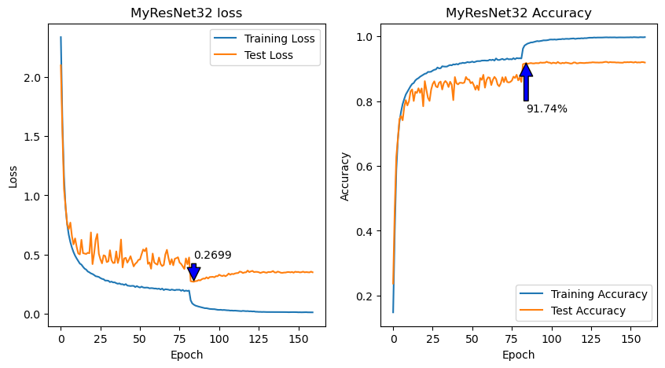
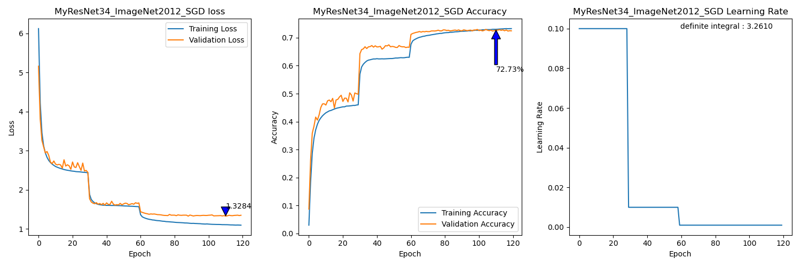
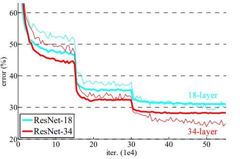

# MyResNet
##### LEE, JIHO
> Dept. of Embedded Systems Engineering, Incheon National University

> jiho264@inu.ac.kr /  jiho264@naver.com
 
- The purpose of this project is that to create a ResNet using Pytorch and to get the accuracy of near original paper's one!
- [x] The Origin ResNet32 have 7.51% top-1 error rate in CIFAR-10 dataset.
- [ ] The Origin ResNet34 have 21.53% top-1 error rate in ImageNet2012 dataset.
  >Haven't achieved that yet. 
---
# 1. Usage
## 1.1. Requierments
  - ```Ubuntu 22.04 LTS```
  - ```Python 3.11.5```
  - ```Pytorch 2.2.0```
  - ```CUDA 12.1```
  - ```pip [copy, time, tqdm, matplotlib, etc..]```
  - I used ```i7-9700k, DDR4 64GB, GTX3090```

## 1.2. The Manual from Original Paper
### 1.2.1. Implementation about training process :
  - [x] We initialize the weights as on **He initialization**
  - [x] We adopt **batch normalization** after each convolutional and before activation
  - [x] We use **SGD** with a **mini-batch size of 256**
  - [x] The learning rate starts from **0.1** and is **divided by 10** when the error plateaus
  - [x] We use a **weight decay of 0.0001** and a **momentum of 0.9**
  - [x] We **do not use** dropout
  
### 1.2.2. ```MyResNet34``` preprocessing for ImageNet2012 :
  - [x] The image is resized with its shorter side randomly sampled in [256, 480] for scale augmentation [41]. 
  - [x] A 224×224 crop is randomly sampled from an image or its horizontal flip, with the per-pixel mean subtracted [21]. 
  - [x] The standard color augmentation in [21] is used.
    > So, Apply ```PCA_Color_Augmentation```
  - [x] In testing, for comparison studies we adopt the standard 10-crop testing [21]. For best results, we adopt the fully- convolutional form as in [41, 13], and average the scores at multiple scales (images are resized such that the shorter side is in {224, 256, 384, 480, 640}).
    > Implemented on ```src/Prediction_for_MultiScaleTest.ipynb```

### 1.2.3. ```MyResNet_CIFAR``` preprocessing for CIFAR10 :
  - [x] 45k/5k train/valid split from origin train set(50k)
  - [x] 4 pixels are padded on each side, and a 32 x 32 crop is randomly sampled from the padded image or its horizontal flip.
  - [x] For testing, use original images
---

# 2. Experiments
## 2.1. ResNet32 Model on CIFAR10 
### 2.1.1. Setup
```py
model = MyResNet_CIFAR(num_classes=10, num_layer_factor = 5, Downsample_option="A").to("cuda")
criterion = nn.CrossEntropyLoss()
optimizer = optim.SGD(model.parameters(), lr=0.1, momentum=0.9, weight_decay=1e-4)
scheduler = optim.lr_scheduler.MultiStepLR(optimizer, milestones=[82, 123], gamma=0.1)
earlystopper = EarlyStopper(patience=999, model=model, file_name=file_name)
```
- ```epochs = 180```
- ```batch = 128```
```py 
train.transforms = Compose([
    Compose([ToImage(), ToDtype(scale=True)])
    RandomCrop(32, padding=4),
    RandomHorizontalFlip(),
    Normalize(mean=[0.485, 0.456, 0.406], std=[0.229, 0.224, 0.225]),
]) 
test.transforms = Compose([
    Compose([ToImage(), ToDtype(scale=True)])
    Normalize(mean=[0.485, 0.456, 0.406], std=[0.229, 0.224, 0.225]),
]) 
```
### 2.1.2. Result


---
## 2.2. Best ResNet34 model on ImageNet2012
### 2.2.1. Setup
```py
model = MyResNet34(num_classes=1000, Downsample_option="B").to("cuda")
criterion = nn.CrossEntropyLoss()
optimizer = optim.SGD(model.parameters(), lr=0.1, momentum=0.9, weight_decay=1e-4)
scheduler = optim.lr_scheduler.MultiStepLR(optimizer, milestones=[30, 60], gamma=0.1)
file_name = "MyResNet34_ImageNet2012_rezero"
earlystopper = EarlyStopper(patience=999, model=model, file_name=file_name)
```
- ```epochs = 120```
- ```batch = 256```
```py
# PCAColorAugmentation
class PCAColorAugmentation(object):
    """
    ResNet paper's say; The standard color augmentation in [21] is used.
    - [21] : AlexNet paper.
    - PCA Color Augmentation

    1. Get the eigenvalue and eigenvector of the covariance matrix of the image pixels. (ImageNet2012)
    2. [r, g, b] = [r, g, b] + [p1, p2, p3] matmul [a1 * r1, a2 * r2, a3 * r3].T
    """

    def __init__(self):

        self._eigval = torch.tensor([55.46, 4.794, 1.148]).reshape(1, 3)
        self._eigvec = torch.tensor(
            [
                [-0.5675, 0.7192, 0.4009],
                [-0.5808, -0.0045, -0.8140],
                [-0.5836, -0.6948, 0.4203],
            ]
        )

    def __call__(self, _tensor: torch.Tensor):
        """
        Input : torch.Tensor [C, H, W]
        Output : torch.Tensor [C, H, W]
        """
        return _tensor + torch.matmul(
            self._eigvec,
            torch.mul(self._eigval, torch.normal(mean=0.0, std=0.1, size=[1, 3])).T,
        ).reshape(3, 1, 1)
# Training set
train = Compose(
   RandomShortestSize(min_size=range(256, 480), antialias=True),
   RandomCrop(size=224),
   Compose([ToImage(), ToDtype(torch.float32, scale=True)]),
   Normalize(
      mean=[0.485, 0.456, 0.406], std=[0.229, 0.224, 0.225], inplace=True
   ),
   PCAColorAugmentation(),
   RandomHorizontalFlip(),
)
# center croped valid set
valid = Compose(
   RandomShortestSize(min_size=range(256, 480), antialias=True),
   # VGG에서 single scale로 했을 때는 두 range의 median 값으로 crop함.
   CenterCrop(size=368),
   Compose([ToImage(), ToDtype(torch.float32, scale=True)]),
   Normalize(
      mean=[0.485, 0.456, 0.406], std=[0.229, 0.224, 0.225], inplace=True
   ),
)
```
### 2.2.2. Result
- Training & Center Crop Validation
  - 
  - 
    - Figure 4. Training on ImageNet. Thin curves denote training error, and bold curves denote validation error of the center crops. Right: ResNets of 18 and 34 layers. In this plot, the residual networks have no extra parameter compared to their plain counterparts.
    - 빨간 실선 (Center Crop valid)의 최저 수치는 약 25%가량으로, MyResNet34의 최저 error 27.27%과 비슷함.

- 10-Crop Testing
   ```py
   # 10-croped valid set
   scales = [224, 256, 384, 480, 640]
   valid  = Compose(
      RandomShortestSize(min_size=scales[i] + 1, antialias=True),
      Compose(
            [ToImage(), ToDtype(torch.float32, scale=True)]
      ),
      Normalize(
            mean=[0.485, 0.456, 0.406], std=[0.229, 0.224, 0.225], inplace=True
      ),
      TenCrop(size=scales[i]),
   )
   ```
   ```bash
   Model is loaded from MyResNet34_ImageNet2012_rezero.pth
   Dataset 224: Loss: 1.282425, Top-1 Acc: 68.80%, Top-5 Acc: 88.47%
   Dataset 256: Loss: 1.183675, Top-1 Acc: 70.91%, Top-5 Acc: 89.78%
   Dataset 384: Loss: 1.306427, Top-1 Acc: 72.76%, Top-5 Acc: 91.09%
   Dataset 480: Loss: 1.581165, Top-1 Acc: 71.49%, Top-5 Acc: 90.47%
   Dataset 640: Loss: 2.098562, Top-1 Acc: 65.77%, Top-5 Acc: 87.33%
   Avg Loss: 1.490451, Avg Top-1 Acc: 69.95%, Avg Top-5 Acc: 89.43%
   ```
   - Origin paper ResNet-34 B :  
     - Top-1 error : 24.52 % (me : 30.05%)
     - Top-5 error : 7.46 % (me : 10.57%)
     - Center Crop Validation에서는 비슷한 수치를 나타냈는데, 10-Crop Testing에서는 완전한 성능을 내지 못함.

# 3. Conclusion
- 논문의 수치에 다다르지 못해 아쉽지만, 어느 정도 구현해본 것에 의의를 둠.
- 여러 폐기된 실험은 ```Readme_old.md```에서 확인 가능.
- 알게된 주의사항 : 
  - Dataloader.transforms에서 할 일들을 외부에서 처리하는 것은 training에 악영향이 있음. 
  - PCA color augmentaion은 데이터셋 전체에 대해 eigvec, eigval을 구한 뒤, N(0, 0.01^2) 분포에 근거해 적절히 증감.
  - 모델의 안정성과 완성도가 확보되지 않은 상황에서 AutoAugment 사용 지양.
  - Train에서 Submean 했으면, Test에서도 당연히 해야함. 어느 정도 Test 수치가 잘 나오긴 하지만, 완벽한 숫자가 아님.


