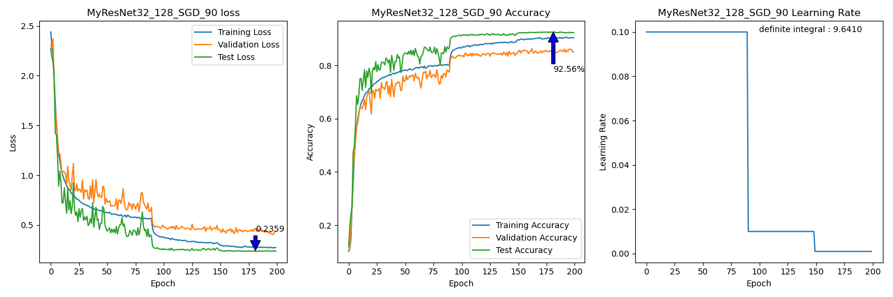
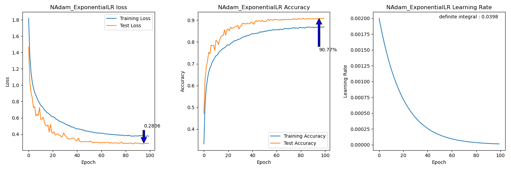
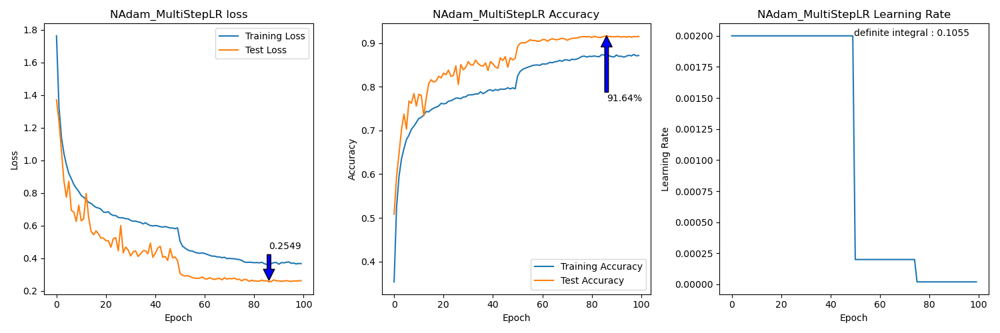
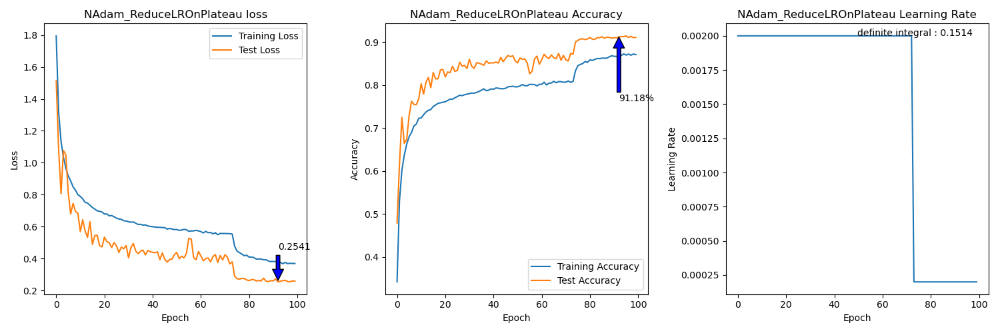
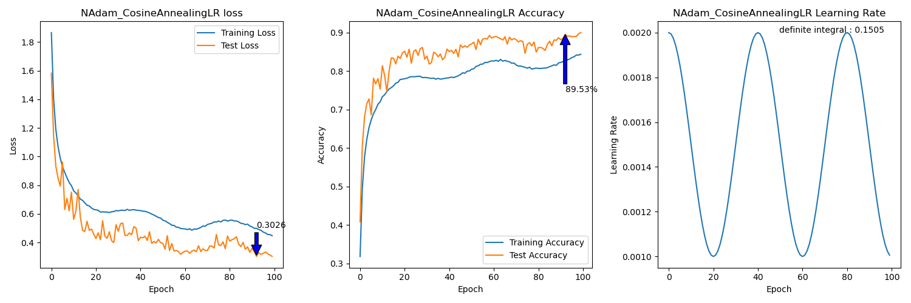
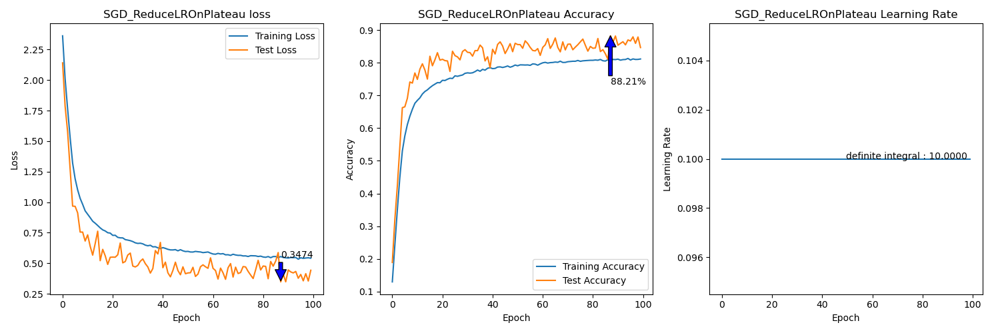

# MyResNet
##### LEE, JIHO
> Dept. of Embedded Systems Engineering, Incheon National University

> jiho264@inu.ac.kr /  jiho264@naver.com
 
- The purpose of this project is that to create a ResNet using Pytorch and to get the accuracy of near original paper's one!
- [x] The Origin ResNet32 have 7.51% top-1 error rate in CIFAR-10 dataset.
- [ ] The Origin ResNet34 have 21.53% top-1 error rate in ImageNet2012 dataset.
  >Haven't achieved that yet. 
---
# 1. Usage
## 1.1. Requierments
  - ```Ubuntu 20.04 LTS```
  - ```Python 3.11.5```
  - ```Pytorch 2.1.1```
  - ```CUDA 11.8```
  - ```pip [copy, time, tqdm, matplotlib, etc..]```
  - I used ```i7-9700k, DDR4 64GB, GTX3090```
## 1.2. How to compose this repo?
```bash
├── data "The root dir of torch.utils.data.Dataloader"
│   ├── etc..
│   └── ImageNet2012 "Need to download"
│       ├── train
│       └── val
├── models
│   ├── 2-1-Autoaugment
│   │   └── etc..
│   ├── 2-2-Split_test
│   │   └── etc..
│   ├── 2-3-Optim_test
│   │   └── etc..
│   ├── 2-4-Schedulers_test
│   │   └── etc..
│   └── 2-5-ImageNet_test
|       └── etc..
└── src
    └── "Source Codes"
``` 
## 1.3. How to run 
  - Run ```models/{dir}/{model_name}_{dataset}_{batch}_{optimizer}.ipynb```
  - Options
    - ```BATCH = 256```
    - ```DATASET = {"CIFAR10", "CIFAR100", "ImageNet2012"}```
    - ```optimizer = {"Adam", "AdamDecay", "SGD"}```
  - The trained model is ```{model_name}_{dataset}_{batch}_{optimizer}.pth```
## 1.4. The Manual from Original Paper
### 1.4.1. Implementation about training process :
  - [x] We initialize the weights as on **He initialization**
  - [x] We adopt **batch normalization** after each convolutional and before activation
  - [x] We use **SGD** with a **mini-batch size of 256**
  - [x] The learning rate starts from **0.1** and is **divided by 10** when the error plateaus
  - [x] We use a **weight decay of 0.0001** and a **momentum of 0.9**
  - [x] We **do not use** dropout
  
### 1.4.2. ```MyResNet34``` preprocessing for ImageNet2012 :
  - [x] The image is resized with its shorter side randomly sampled in [256, 480] for scale augmentation [41]. 
  - [x] A 224×224 crop is randomly sampled from an image or its horizontal flip, with the per-pixel mean subtracted [21]. 
  - [x] The standard color augmentation in [21] is used.
    > So, Apply ```torchvision.transform.AutoAugment()```
  - [x] In testing, for comparison studies we adopt the standard 10-crop testing [21]. For best results, we adopt the fully- convolutional form as in [41, 13], and average the scores at multiple scales (images are resized such that the shorter side is in {224, 256, 384, 480, 640}).
    > Implemented on ```src/Prediction_for_MultiScaleTest.ipynb```

### 1.4.3. ```MyResNet_CIFAR``` preprocessing for CIFAR10 :
  - [x] 45k/5k train/valid split from origin train set(50k)
  - [x] 4 pixels are padded on each side, and a 32 x 32 crop is randomly sampled from the padded image or its horizontal flip.
  - [x] For testing, use original images
---

# 2. Experiments
## 2.1. AutoAugment is good?
- 동일한 세팅에서, 164 epochs (64k iterations) 학습 후, Test loss 및 Test acc를 비교함.
- 파란 화살표는 Test loss가 최소인 Best model의 성능임.
### 2.1.1. Case 1 : Submean -> AutoAugment
Aug.png" style="width: 600px; height: 300px;"/>

### 2.1.2. Case 2 : Submean


### 2.1.3. Case 3 : AutoAugment -> Submean
Submean.png" style="width: 600px; height: 300px;"/>

### 2.1.4. Conclusion
1. (1)과 (2)의 비교를 통해, AutoAugment을 적용하는 것이 더 좋은 결과를 보임.
2. (1)과 (3)의 비교를 통해, Submean 이후에 AutoAugment를 적용하는 것이 더 좋은 결과를 보임. 
   - 최소 Test loss 지점의 모델이 가지는 loss 및 acc모두 (1)이 높고, 학습 시에 loss의 진동도 적음.
3. 결론적으로, (1)의 방법이 가장 좋다고 볼 수 있음.
4. 추가적으로, (1)에서만 Test 시에 Test acc가 train acc보다 높은 것을 볼 수 있음. AutoAugment가 워낙 변칙적이라, 학습은 잘 되면서 Training은 더 어렵게 잘 Augmentation하는 것으로 보임.
    
    ---
## 2.2. ResNet32 Model on CIFAR10 
```py 
train.transforms = Compose(
    Compose([ToImage(), ToDtype(scale=True)])
    Normalize(mean=[0.49139968, 0.48215827, 0.44653124], std=[1, 1, 1], inplace=True)
    AutoAugment(interpolation=InterpolationMode.NEAREST, policy=AutoAugmentPolicy.CIFAR10)
    RandomCrop(size=(32, 32), padding=[4, 4, 4, 4], pad_if_needed=False, fill=0, padding_mode=constant)
    RandomHorizontalFlip(p=0.5)
) 
test.transforms = ToTensor() 
```

### 2.2.1. [BEST] MyResNet32_CIFAR_128_SGD_00
- ```164 epochs``` (=64k iterations)
- ```batch = 128```
- ```split_ratio = 0```
- ```optimizer = torch.optim.SGD(model.parameters(), lr=0.1, momentum=0.9, weight_decay=1e-4)```
- ```scheduler = ReduceLROnPlateau(patiance=10, factor=0.1, cooldown=40)```
   > Train loss를 ReduceLROnPlateau의 Step에서 사용함.
   
   

### 2.2.2. MyResNet32_CIFAR_128_SGD_90
- ```batch = 128```
- ```split_ratio = 0.9```
- ```optimizer = torch.optim.SGD(model.parameters(), lr=0.1, momentum=0.9, weight_decay=1e-4)```
- ```scheduler = ReduceLROnPlateau(patiance=10, factor=0.1, cooldown=40)```
- ```EarlyStopCounter = 50```
   

### 2.2.3. MyResNet32_CIFAR_128_SGD_95 
- ```batch = 128```
- ```split_ratio = 0.95```
- ```optimizer = torch.optim.SGD(model.parameters(), lr=0.1, momentum=0.9, weight_decay=1e-4)```
- ```scheduler = ReduceLROnPlateau(patiance=10, factor=0.1, cooldown=40)```
- ```EarlyStopCounter = 50```
   


### 2.2.5. Conclusion
- split한 것과의 비교
  - 간단한 Dataset이라, Validation Set으로 Learning Rate Scheduling이 기대만큼 효과적이지 않았음.
  - 오히려, Validation Set마저 학습했을 때에 가장 모델의 정확도가 높았음. 

## 2.3. Which Optimizer is the best?
### 2.3.1. Comparing on CIFAR10
- ```Use MyResNet32```
- ```All batch = 128```
- ```All scheduler = ExponentialLR(optimizer, gamma=0.95)```
- ```epochs = 100```

- | Optimizer | Test Loss | Test Acc |
  |:------------:|:------:|:------:|
  | **NAdam**    | 0.2780 | **90.68**% |
  | **SGD**      | 0.2987 | **89.99%**|
  | SGD_nasterov | 0.3079 | 89.33% |
  | Adam_decay   | 0.3296 | 88.34% |
  | AdamW        | 0.3520 | 88.16% |
  | AdamW_amsgrad| 0.3554 | 88.22% |
  | Adam         | 0.3574 | 87.62% |
  
  > **NAdam** - SGD - SGD_nasterov - Adam_decay - Adam_amsgrad - AdamW - Adam 
### 2.3.2. Figures
<details>
<summary>[view figures]</summary>
<ul>
      <li>1. Adam : ```optimizer = torch.optim.Adam(model.parameters())```</li>
            
      <li>2. Adam with decay : ```optimizer = torch.optim.Adam(model.parameters(), weight_decay=1e-4)```</li>
         
      <li>3. AdamW : ```optimizer = torch.optim.AdamW(model.parameters(), weight_decay=1e-4)```</li>
         
      <li>4. AdamW with amsgrad : ```optimizer = torch.optim.AdamW(model.parameters(), weight_decay=1e-4, amsgrad=True)```</li>
            
      <li>5. NAdam : ```optimizer = torch.optim.NAdam(model.parameters(), weight_decay=1e-4)```</li>
            
      <li>6. SGD : ```optimizer = torch.optim.SGD(model.parameters(), lr=0.1, momentum=0.9, weight_decay=1e-4)```</li>
            
      <li>7. SGD with nasterov : ```optimizer = torch.optim.SGD(model.parameters(), lr=0.1, momentum=0.9, weight_decay=1e-4, nesterov=True)```</li>
      
</ui>
</details>

   
### 2.3.3. ALL


## 2.4. Which Scheduler is the best?
### 2.4.1. Comparing on CIFAR10
- ```Use MyResNet32```
- ```All batch = 128```
- ```epochs = 100```

- | Optimizer    | Scheduler  | Test Loss | Test Acc |
  |:------------:|:---------------------------:|:------:|:------:|
  | **NAdam**    |**ReduceLROnPlateau**            |0.2541 |**91.18%**  |  
  | **SGD**      |**CosineAnnealingLR**            |0.2544 |**91.18%**  |
  | **NAdam**    |**MultiStepLR**                  |0.2549 |**91.64%**  |
  | SGD          |MultiStepLR                      |0.2640 |90.76%  |
  | NAdam        |CosineAnnealingWarmRestarts14    |0.2790 |90.51%  | 
  | NAdam        |ExpoentialLR                     |0.2806 |90.77%  | 
  | SGD          |ExpoentialLR                     |0.2942 |89.93%  |
  | NAdam        |CosineAnnealingLR                |0.3026 |89.53%  |        
  | NAdam        |CosineAnnealingWarmRestarts10    |0.3148 |89.43%  |
  | SGD          |CosineAnnealingWarmRestarts14    |0.3227 |89.17%  |
  | NAdam        |CosineAnnealingWarmRestarts8     |0.3233 |89.09%  |                
  | SGD          |ReduceLROnPlateau                |0.3474 |88.21%  |
  | SGD          |CosineAnnealingWarmRestarts10    |0.3602 |87.92%  |      
  | SGD          |CosineAnnealingWarmRestarts8     |0.3704 |87.65%  |
       
   > **NAdam ReduceLROnPlateau** - **SGD CosineAnnealingLR** - **NAdam MultiStepLR** - etc..
   > 상위 3개의 case 오차 3%이내.

- ```NAdam``` : ```torch.optim.NAdam(model.parameters(), weight_decay=1e-4)```
- ```SGD``` : ```optimizer = torch.optim.SGD(model.parameters(), lr=0.1, momentum=0.9, weight_decay=1e-4)```
- ExponentialLR : ```ExponentialLR(self.optimizer, gamma=0.95)```
- MultiStepLR : ```MultiStepLR(self.optimizer, milestones=[50, 75], gamma=0.1)```
- ReduceLROnPlateau : ```ReduceLROnPlateau(self.optimizer, patiance=5, factor=0.1, cooldown=2)```
- CosineAnnealingLR : ```CosineAnnealingLR(self.optimizer, T_max=20, eta_min=0.001)```
- CosineAnnealingWarmRestarts8 : ```CosineAnnealingWarmRestarts(self.optimizer, T_0=8, T_mult=2, eta_max=0.002, T_up=2, gamma=0.5)```
- CosineAnnealingWarmRestarts10 : ```CosineAnnealingWarmRestarts(self.optimizer, T_0=10, T_mult=2, eta_max=0.002, T_up=2, gamma=0.5)```
- CosineAnnealingWarmRestarts14 : ```CosineAnnealingWarmRestarts(self.optimizer, T_0=14, T_mult=2, eta_max=0.002, T_up=2, gamma=0.5)```

### 2.4.2. Figures


#### 2.4.2.1. NAdam

<details>
<summary>[view figures]</summary>
<ul>
   <li>1. ExponentialLR : ```ExponentialLR(self.optimizer, gamma=0.95)```</li>
   
   <li>2. MultiStepLR : ```MultiStepLR(self.optimizer, milestones=[50, 75], gamma=0.1)```</li>
   
   <li>3. ReduceLROnPlateau : ```ReduceLROnPlateau(self.optimizer, patiance=5, factor=0.1, cooldown=2)```</li>
   
   <li>4. CosineAnnealingLR : ```CosineAnnealingLR(self.optimizer, T_max=20, eta_min=0.001)```</li>
   
   <li>5. CosineAnnealingWarmRestarts8 : ```CosineAnnealingWarmRestarts(self.optimizer, T_0=8, T_mult=2, eta_max=0.002, T_up=2, gamma=0.5)```</li>
   
   <li>6. CosineAnnealingWarmRestarts10 : ```CosineAnnealingWarmRestarts(self.optimizer, T_0=10, T_mult=2, eta_max=0.002, T_up=2, gamma=0.5)```</li>
   
   <li>7. CosineAnnealingWarmRestarts14 : ```CosineAnnealingWarmRestarts(self.optimizer, T_0=14, T_mult=2, eta_max=0.002, T_up=2, gamma=0.5)```</li>
   
</ul>
</details>

#### 2.4.2.2. SGD
<details>
<summary>[view figures]</summary>
<ul>
   <li>1. ExponentialLR : ```ExponentialLR(self.optimizer, gamma=0.95)```</li>
   
   <li>2. MultiStepLR : ```MultiStepLR(self.optimizer, milestones=[50, 75], gamma=0.1)```</li>
   
   <li>3. ReduceLROnPlateau : ```ReduceLROnPlateau(self.optimizer, patiance=5, factor=0.1, cooldown=2)```</li>
   
   <li>4. CosineAnnealingLR : ```CosineAnnealingLR(self.optimizer, T_max=20, eta_min=0.001)```</li>
   
   <li>5. CosineAnnealingWarmRestarts8 : ```CosineAnnealingWarmRestarts(self.optimizer, T_0=8, T_mult=2, eta_max=0.002, T_up=2, gamma=0.5)```</li>
   
   <li>6. CosineAnnealingWarmRestarts10 : ```CosineAnnealingWarmRestarts(self.optimizer, T_0=10, T_mult=2, eta_max=0.002, T_up=2, gamma=0.5)```</li>
   
   <li>7. CosineAnnealingWarmRestarts14 : ```CosineAnnealingWarmRestarts(self.optimizer, T_0=14, T_mult=2, eta_max=0.002, T_up=2, gamma=0.5)```</li>
   
</ul>
</details>

---

## 2.5. Best ResNet34 model on ImageNet2012
### 2.5.1.1. Setup
```py
# Training set
train = Compose(
    RandomShortestSize(min_size=range(256, 480), antialias=True),
    RandomCrop(size=224),
    Compose([ToImage(), ToDtype(torch.float32, scale=True)]),
    Normalize(mean=[0.485, 0.456, 0.406], std=[1, 1, 1], inplace=True),
    AutoAugment(policy=AutoAugmentPolicy.IMAGENET),
    RandomHorizontalFlip(0.5),
)
# center croped valid set
valid = Compose(
    RandomShortestSize(min_size=range(256, 480), antialias=True),
    CenterCrop(size=368),
    ToTensor(),
    Normalize(mean=[0.485, 0.456, 0.406], std=[1, 1, 1], inplace=True),
)
# 10-croped valid set
scales = [224, 256, 384, 480, 640]
valid  = Compose(
    RandomShortestSize(min_size=scale[i]+1, antialias=True)
    TenCrop(size=scale[i])
    ToTensor()
    Normalize(mean=[0.485, 0.456, 0.406], std=[1, 1, 1], inplace=True)
)
```
- ```epochs = 150```
- ```batch = 256```
- ```earlystop = 15```
- [Jan 30]
  - Dataloader.dataset.transform.transforms 내부 Compose 순서에 따라 코드의 동작속도가 많이 달라짐.
  - 이미지를 크롭하고나서 Augmentation을 적용하는 것이 유리함.
- [Jan 31]
  -  dataloader에서 transforms를 CPU에서 처리하는게 오래걸림에 따라, ```ImageNetdataloader.py```에서 별도로 클래스 지정 후, 실제 학습 시 반쯤 전 처리된 데이터를 GPU로 올리고 나머지를 마저 처리함. (single epoch당 소요시간 30분에서 약 21분으로 감소), 
  -  valid set도 normalize 단계는 GPU에서 처리.(여기는 속도 향상 미미함.)
- [Feb 1]
  - 다만, 3가지 case 동시실험하느라 GPU 점유율 99%이므로, CPU에서 전처리 모두 수행하는 이전 코드로 변경 

### 2.5.1. MyResNet34_ImageNet_256_NAdam_ReduceLROnPlateau
- ```optimizer = torch.optim.NAdam(model.parameters(), weight_decay=1e-4)```
- ```scheduler = ReduceLROnPlateau(patiance=5, factor=0.1, cooldown=5)```
   
### 2.5.2. MyResNet34_ImageNet_256_NAdam_MultiStepLR
- ```optimizer = torch.optim.NAdam(model.parameters(), weight_decay=1e-4)```
- ```scheduler = MultiStepLR(optimizer, milestones=[30, 60], gamma=0.1)```
   
### 2.5.3. MyResNet34_ImageNet_256_SGD_MultiStepLR
- ```optimizer = torch.optim.SGD(model.parameters(), lr=0.1, momentum=0.9, weight_decay=1e-4)```
- ```scheduler = MultiStepLR(optimizer, milestones=[30, 60], gamma=0.1)```
   


# 3. Todo
1. ```TenCrop 잘못했나 찾아보기. ResNet34의 test acc가 너무 낮게 나왔음.```
   1. 논문의 training 할 때의 center crop으로 valid acc그린 plot있는데, lr=0.001인 부분에서 training acc가 해당 그래프 만큼 나오지 않음.
2. ```SGD말고 다른 Optimizer 적용해볼 수 있는지 알아보기.```
   1. MyResNet34_ImageNet2012_256_Multi에서 Datalodaer 1번에 두 가지 모델 병렬학습 구현 [Jan 26]. 및 AdamW, Adam with decay 학습 중.
   2. Adam에 weight decay 적용한게 AdamW임. Adam에 decay=1e-4주는거랑 똑같지만, option으로 amsgrad=True만 다름.